# EnhanceExcel2Anything 技术文档

## 🚀 核心亮点
**5行配置模式** - 只需填写Excel表格前5行即可生成完整C#数据类，策划人员也能轻松上手！

---

## 📖 目录
- [功能概述](#-功能概述)  
- [极简配置规范](#-极简配置规范)  
- [智能校验系统](#-智能校验系统)  
- [高级功能](#-高级功能)  
- [生成示例](#-生成示例)  
- [使用指南](#-使用指南)  

---

## 🌟 功能概述
专为游戏开发设计的Excel数据转换工具，实现：
- **零代码生成**：Excel → 强类型C#类（支持泛型/自定义类型）
- **热更新就绪**：完美适配HybridCLR热更框架
- **企业级校验**：丰富内置数据校验规则
- **高效内存管理**：LRU缓存
- **多语言支持**：自动提取所有中文字符

---

## 📝 极简配置规范
### 配置模板（仅需5行！）
```excel
| (A1)配置表名 | MonsterConfig         |
|--------------|-----------------------|
| 字段名       | id   | name    | skills     |
| 字段类型     | int  | string  | List<int>  |
| 功能标签     | CheckRepeat | Default:"无名" | ListSeparator:, |
| 注释         | 怪物ID | 名称    | 技能列表   |
| 数据         | 1001 | 史莱姆   | 201,205    |
```

### 配置规则详解
| 行号 | 作用           | 示例                | 必填 | 说明                                                                 |
|------|----------------|---------------------|------|----------------------------------------------------------------------|
| A1   | 配置表名       | `ItemConfig`        | ✔️   | 空值Sheet自动忽略，支持跨Sheet合并                                   |
| 1    | 字段名称       | `id` `itemName`     | ✔️   | 直接映射为C#属性名                            |
| 2    | 字段类型       | `int` `List<string>`| ✔️   | 支持C#原生类型 + 泛型 + 自定义类型（需在`custom_types.yaml`注册）   |
| 3    | 功能标签       | `CheckRepeat`       | ✖️   | 多标签用 ; 分隔                                |
| 4    | 注释说明       | "物品唯一标识"      | ✖️   | 自动生成XML文档注释                                                 |
| 5+   | 配置数据       | `101` `治疗药剂`    | -    | 保留Excel原生编辑体验                                               |

---

## 🔍 智能校验系统
### 校验流程

```mermaid
graph TD
    A[读取Excel] --> B{基础校验}
    B -->|通过| C[类型校验]
    B -->|失败| D[生成错误报告]
    C -->|通过| E[业务规则校验]
    C -->|失败| D
    E -->|通过| F[生成代码]
    E -->|失败| D
```


### 校验规则示例
| 校验类型       | 触发条件                  | 错误示例                    | 解决方案                     |
|----------------|---------------------------|-----------------------------|------------------------------|
| 重复值检查     | 标记CheckRepeat的列有重复 | ID列出现重复的1001          | 检查Excel数据唯一性          |
| 外键引用检查   | CheckLink指向不存在的数据 | 关联表TableB不存在id=5的数据| 修正数据或更新关联表         |
| 类型格式检查   | 数据与声明类型不匹配      | 将"abc"填入int类型字段      | 修正数据或修改类型声明       |

---

## 🛠️ 高级功能
### 功能标签详解
| 标签格式                   | 作用域      | 示例                          | 功能说明                                                                 |
|----------------------------|-------------|-------------------------------|--------------------------------------------------------------------------|
| `CheckRepeat`              | 任意字段    | -                             | 唯一性校验，生成`Dictionary`快速访问器                                  |
| `CheckLink:表名_字段_忽略值`| 数值/字符串 | `CheckLink:Item_id_0`        | 外键验证（当值不为0时检查Item表是否存在对应id）                        |
| `Default:值`               | 所有类型    | `Default:10` `Default:"空"`  | 空值自动填充（智能类型转换）                                           |
| `ListSeparator:符号`       | 列表类型    | `ListSeparator:#`           | 自定义列表分隔符（默认`\|`）                                           |
| `MapSeparator:符号`        | 字典类型    | `MapSeparator:@`             | 自定义字典项分隔符（默认`\|`，键值对保持`key:value`格式）               |
| `DateFormat:格式`          | 日期类型    | `DateFormat:yyyy-MM-dd`      | 指定日期解析格式（默认`yyyy/MM/dd HH:mm:ss`）                          |

### 扩展功能
- **多语言支持**  
  自动提取所有中文字符到独立文本文件，生成多语言键：

  [Raw]  
  TableA/0f3a=1阶  
  TableA/c024=2阶

- **LRU缓存策略**  
  自动维护最近使用的配置表在内存中，通过`ConfigMemoryPool.Get<T>()`API智能管理

- **变更检测**  
  基于文件哈希值比对，仅处理修改过的Excel文件

- **自动排序值类型与引用类型**  
  全自动排序值类型与引用类型，使得内存结构紧凑
  
---

## 🧩 生成示例
### 输入Excel
|     SkillConfig     | A           | B             | C             |
|----------|-------------|---------------|---------------|
| **1**    | skillID     | skillType     | effectParams  |
| **2**    | int         | SkillType| Dictionary<int,float> |
| **3**    | CheckRepeat | Default:Attack| MapSeparator:\| |
| **4**    | 技能ID      | 类型          | 效果参数       |
| **5**    | 301         | Buff          | 1:0.2\|2:0.5  |

### 生成C#代码
- **基础Excel配置字段**  
```csharp
public readonly struct SkillConfig
{
    /// <summary>
    /// 技能ID
    /// </summary>
    public int skillID { get; }

    /// <summary>
    /// 类型
    /// </summary>
    public SkillType skillType { get; }

    /// <summary>
    /// 效果参数
    /// </summary>
    public Dictionary<int, float> effectParams { get;}

    internal SkillConfig(int skillID, SkillType skillType, Dictionary<int, float> effectParams)
    {
        this.skillID = skillID;
        this.skillType = skillType;
        this.effectParams = effectParams;
    }
}
```
- **Excel配置数据**  
```csharp

public partial class SkillConfigDB : ConfigBase
{
    private SkillConfig[] _data;
    private Dictionary<int, int> _idToIdx;

     
    protected override void ConstructConfig()
    {
       _data = new SkillConfig[]
       {
           new(skillID: 301, skillType:SkillType.Buff , effectParams: new Dictionary<int, float>() { [1] = 0.2f, [2] = 0.5f }
        };
            
        MakeIdToIdx();
    }
        
    public ref readonly SkillConfig this[int skillID]
    {
         get
         {
             TackUsage();
             var ok = _idToIdx.TryGetValue(skillID, out int idx);
             if (!ok)
               UnityEngine.Debug.LogError($"[SkillConfig] skillID: {skillID} not found");
             return ref _data[idx];
         }
    }
        
    public SkillConfig[] All => _data;
        
    public int Count => _data.Length;
        
    public override void Dispose()
    {
        _data = null;
        OnDispose();
    }
        
    private void MakeIdToIdx()
    {
        _idToIdx = new Dictionary<int,int>(_data.Length);
        for (int i = 0; i < _data.Length; i++)
        {
            _idToIdx[_data[i].id] = i;
        }
    }
}
```

---

## 📥 使用指南
# 运行
```bash
python main.py \
    --input ./design/excels \
    --output ./unity-project/Assets/Data \
    --base_language cs \
    --export_type csharp
```

### 参数说明
| 参数          | 默认值       | 说明                          |
|---------------|-------------|-------------------------------|
| `--input`     | ./excels    | Excel文件目录                 |
| `--output`    | ./output    | 生成文件目录                  |
| `--base_language`    | cs      | 配置字段生成格式(csharp/cpp)    |
| `--export_type`  | csharp          | 输出数据格式(json/csharp/bin)                   |

---
如果您有更好的建议或方案，欢迎提交Issue/PR/💌1030840412@qq.com
